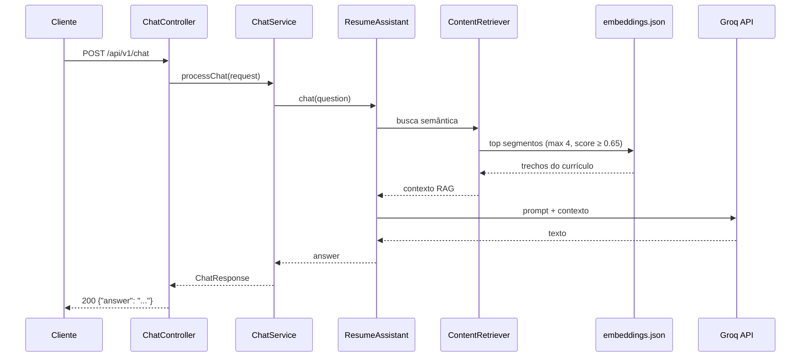

# portfolioai

[](https://openjdk.java.net/)


> API Micronaut que responde perguntas sobre currículo usando RAG local e modelo Groq — projeto de estudo de LangChain4j integrado ao portfolio pessoal.

##  Índice

- [Visão Geral do Negócio](#-visão-geral-do-negócio)
- [Desenvolvimento Local](#-desenvolvimento-local)

---

##  Visão Geral do Negócio

### Propósito

Este projeto foi criado para **estudar e praticar RAG (Retrieval-Augmented Generation) com LangChain4j** em um cenário real. Ele expõe um assistente de currículo que responde apenas com base nos documentos indexados — sem inventar informações fora do contexto recuperado.

Na prática, a API é consumida pelo projeto **Portfolio** (aplicação web pessoal), que faz proxy das perguntas dos visitantes para este serviço.

O fluxo de negócio é simples:

1. O visitante faz uma pergunta no portfolio (ex.: experiência, contatos, formação).
2. O Portfolio encaminha a pergunta para `POST /api/v1/chat`.
3. O serviço recupera trechos relevantes do currículo (RAG) e gera a resposta via Groq.
4. A resposta volta ao visitante em JSON.

### Valor de Negócio

- **Respostas ancoradas no currículo:** o assistente usa apenas o corpus em `docs/` como fonte de verdade.
- **RAG local:** embeddings gerados em build (`embeddings.json`), sem banco vetorial externo em runtime.
- **Stack moderna:** Micronaut 5 + LangChain4j + Groq (API compatível com OpenAI).
- **Integração real:** pensado para rodar atrás do projeto Portfolio, não só como demo isolada.

---

## Desenvolvimento Local

### Pré-requisitos

- **Java 25** (conforme `pom.xml`)
- **Maven 3.9+**
- **Chave de API Groq** (gratuita em [console.groq.com](https://console.groq.com))

### Variáveis de ambiente

| Variável | Obrigatória | Descrição |
|----------|-------------|-----------|
| `GROQ_API_KEY` | Sim | Chave da API Groq. Lida em `application.yml` como `langchain4j.open-ai.api-key`. |

Exemplo:

```bash
export GROQ_API_KEY="gsk_..."
```

Sem essa variável, a aplicação não consegue chamar o modelo de chat em runtime.

### Como rodar

#### 1. Compilar (gera os embeddings)

O build executa automaticamente a ingestão dos arquivos `.md` em `docs/` e grava `target/classes/embeddings.json`:

```bash
mvn clean compile
```

A ingestão também pode ser rodada manualmente:

```bash
mvn exec:java -Dexec.mainClass="com.portfolioai.ingestion.EmbeddingIngestionTask"
```

#### 2. Subir a API

```bash
mvn mn:run
```

Por padrão o Micronaut escuta em **http://localhost:8080**.

#### 3. Testar o chat

```bash
curl -s -X POST http://localhost:8080/api/v1/chat \
  -H 'Content-Type: application/json' \
  -d '{"question": "Qual seu e-mail de contato?"}'
```

Resposta esperada (exemplo):

```json
{"answer": "..."}
```

#### 4. Executar testes

```bash
mvn test -B --no-transfer-progress -Dsurefire.useFile=false -Dtest=!CleanFlowArchUnitTest
```

### Contrato da API

#### `POST /api/v1/chat`

Envia uma pergunta sobre o currículo.

**Request** (`application/json`):

| Campo | Tipo | Obrigatório | Descrição |
|-------|------|-------------|-----------|
| `question` | `string` | Sim | Pergunta do usuário. Não pode ser `null` nem vazia/em branco. |

```json
{
  "question": "Quais tecnologias você usou no Banco Inter?"
}
```

**Response 200** (`application/json`):

| Campo | Tipo | Descrição |
|-------|------|-----------|
| `answer` | `string` | Resposta gerada pelo assistente. |

```json
{
  "answer": "..."
}
```

**Response 400** — corpo vazio quando `question` é `null`, vazia ou só espaços.

### Fluxo RAG



**Build time (ingestão):**

1. Varre `docs/**/*.md` (subpastas = categorias: `profile`, `experience`, `education`, `contacts`, `projects`).
2. Enriquece cada documento com metadados `category` e `source_file`.
3. Divide em segmentos (chunk 3000 / overlap 250).
4. Gera embeddings com **E5 Small V2 Quantized** (ONNX, local).
5. Serializa em `target/classes/embeddings.json`.

**Runtime:**

1. `AiConfig` carrega `embeddings.json` em um `InMemoryEmbeddingStore`.
2. `EmbeddingStoreContentRetriever` busca os segmentos mais similares à pergunta.
3. Parâmetros configuráveis em `application.yml`:

```yaml
portfolioai:
  rag:
    max-results: 4      # máximo de trechos retornados
    min-score: 0.65     # score mínimo de similaridade
```

4. `ResumeAssistant` (LangChain4j `AiServices`) combina o retriever com o modelo **openai/gpt-oss-20b** na Groq (`temperature: 0.2`).

### Corpus de documentos

Os arquivos fonte ficam em `docs/`, organizados por pasta:

| Pasta | Conteúdo |
|-------|----------|
| `profile/` | Resumo e apresentação |
| `experience/` | Experiências profissionais |
| `education/` | Formação e cursos |
| `contacts/` | Canais de contato |
| `projects/` | Projetos pessoais |

Para atualizar o conhecimento do assistente, edite os `.md` e rode `mvn clean compile` (ou a task de ingestão) antes de subir a API.

### Estrutura do projeto

```
src/main/java/com/portfolioai/
├── controller/ChatController.java    # endpoint HTTP
├── service/ChatService.java          # orquestra o assistant
├── ai/ResumeAssistant.java           # interface LangChain4j + system prompt
├── config/AiConfig.java              # RAG + beans LangChain4j
├── config/RagRetrievalProperties.java
└── ingestion/EmbeddingIngestionTask.java  # gera embeddings.json

docs/                                 # corpus RAG (markdown)
src/main/resources/application.yml    # Groq + parâmetros RAG
```

### Configuração do modelo (Groq)

Definida em `src/main/resources/application.yml`:

| Propriedade | Valor |
|-------------|-------|
| `langchain4j.open-ai.chat-model.base-url` | `https://api.groq.com/openai/v1` |
| `langchain4j.open-ai.chat-model.model-name` | `openai/gpt-oss-20b` |
| `langchain4j.open-ai.chat-model.temperature` | `0.2` |

### Comandos úteis

| Comando | Descrição |
|---------|-----------|
| `mvn clean compile` | Compila e regenera `embeddings.json` |
| `mvn mn:run` | Sobe a API localmente |
| `mvn test` | Roda a suíte de testes |
| `mvn package -DskipTests` | Gera o JAR executável |
